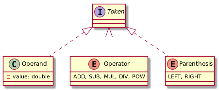
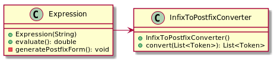
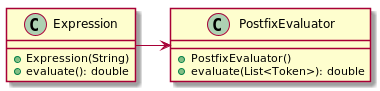

# Evaluator de expresii matematice

Acest proiect implementeaza un evaluator de expresii matematice care accepta cinci operatii matematice (+, -, *, /, ^)
si tine cont de ordinea de evaluare corecta a acestora.

*Nota: diagramele UML de mai jos au rolul de prezentare high-level a entitatilor din program si nu redau toate 
campurile/metodele acestora.*

"Interfata" proiectului (clasa care va putea fi folosita de client) este `Expression`. Aceasta poate fi initializata 
printr-un String care reprezinta o expresie matematica in forma normala. Evaluarea expresiei se poate realiza prin 
apelarea metodei respective.

## Funtionalitate interna

### 1. Tokenizarea expresiei

In momentul instantierei clasei `Expression`, expresia matematica in format String este validata si tokenizata, ceea
ce faciliteaza procesarea ulterioara a acesteia.

`Token` este o interfata implementata de `Operand`, `Operator` si `Parenthesis`.

### 2. Conversia in forma postfixata

Cand este apelata metoda `evaluate()`, mai intai de toate lista de tokenuri este convertita din forma normala in forma
postfixata. Conversia este realizata folosind un algoritm celebru: algoritmul Shunting-yard.

### 3. Evaluarea expresiei

Folosind lista de `Token` in forma postfixata, expresia este evaluata folosind o stiva de operanzi.

